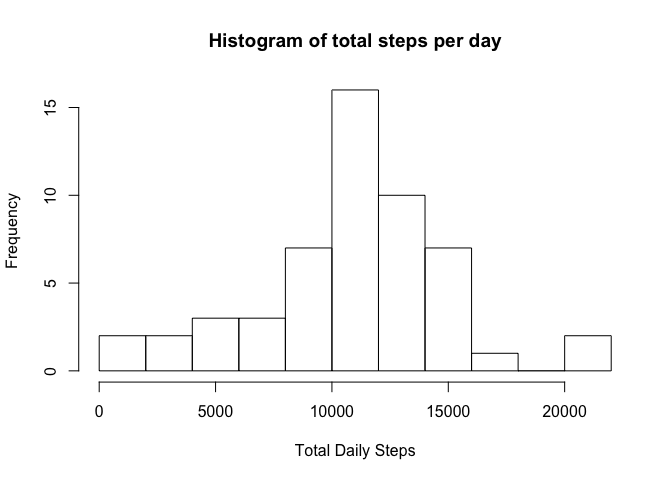
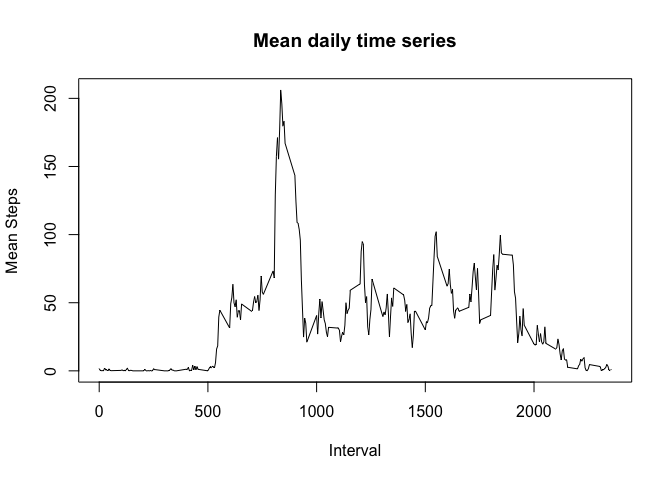
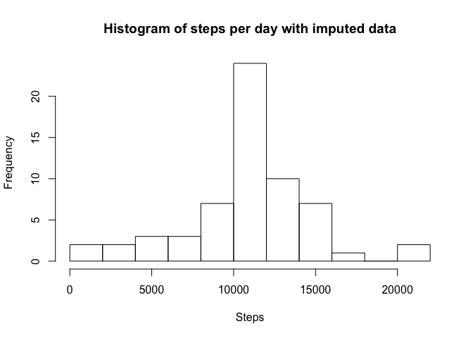
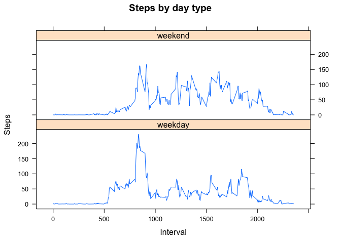

# Reproducible Research: Peer Assessment 1

## Loading and preprocessing the data

Unzip and read the CSV file, converting the 'date' factor to Date class.


```r
df <- read.table(unzip("activity.zip"), sep=",", header=TRUE, na.strings=c('NA'), colClasses=c(NA, "Date", NA))
str(df)
```

```
## 'data.frame':	17568 obs. of  3 variables:
##  $ steps   : int  NA NA NA NA NA NA NA NA NA NA ...
##  $ date    : Date, format: "2012-10-01" "2012-10-01" ...
##  $ interval: int  0 5 10 15 20 25 30 35 40 45 ...
```


## What is mean total number of steps taken per day?


```r
totals <- aggregate(df$steps, by=list(Date=df$date), FUN=sum)
hist(totals$x, main="Histogram of total steps per day", xlab="Total Daily Steps", breaks=10)
```



### Mean steps per day


```r
mean(totals$x, na.rm=TRUE)
```

```
## [1] 10766.19
```

### Median steps per day


```r
median(totals$x, na.rm=TRUE)
```

```
## [1] 10765
```

## What is the average daily activity pattern?


```r
intervals <- aggregate(df$steps, by=list(Interval=df$interval), FUN=mean, na.rm=TRUE)
names(intervals) <- c("Interval", "Steps")
plot(intervals$Interval, intervals$Steps, type="l", 
     main="Mean daily time series",
     ylab="Mean Steps",
     xlab="Interval")
```



### Interval with the most steps on average


```r
intervals[which.max(intervals$Steps), ]
```

```
##     Interval    Steps
## 104      835 206.1698
```

## Imputing missing values

### Number of rows with missing data


```r
sum(is.na(df$steps))
```

```
## [1] 2304
```

### Percentage of intervals missing steps data

```r
(sum(is.na(df$steps)) / nrow(df)) * 100
```

```
## [1] 13.11475
```

### Impute missing data
If steps data is missing, use the mean for that same time interval across the whole data set. 

```r
imputed_df <- assign("imputed_df", df)
for (i in 1:nrow(imputed_df)) {
    if (is.na(imputed_df$steps[i])) {
        imp_val <- intervals$Steps[which(intervals$Interval == imputed_df$interval[i])]
        imputed_df$steps[i] <- imp_val
    }
}
```

As you would expect, filling in missing values with mean data from the 
the rest of the data set drives more days toward the daily mean, as shown in the new histogram.

```r
imp_totals <- aggregate(imputed_df$steps, by=list(Date=imputed_df$date), FUN=sum)
hist(imp_totals$x, main="Histogram of steps per day with imputed data", xlab="Steps", breaks=10)
```



### Mean steps per day, using imputed data


```r
mean(imp_totals$x)
```

```
## [1] 10766.19
```

### Median steps per day, using imputed data


```r
median(imp_totals$x)
```

```
## [1] 10766.19
```


## Are there differences in activity patterns between weekdays and weekends?

Add another column to the imputed data set to track whether the 
observation was on a weekend or weekday. Then average together 
the daily intervals for each day type and display a plot.


```r
daytypefun <- function(d) {
    if (weekdays(d) %in% c("Saturday", "Sunday")) {
        return ("weekend")
    } else {
        return ("weekday")
    }
}
imputed_df$daytype <- sapply(imputed_df$date, FUN=daytypefun)
imputed_df$daytype <- factor(imputed_df$daytype)

wkdy_df <- aggregate(imputed_df$steps, by=list(daytype=imputed_df$daytype, interval=imputed_df$interval), FUN=mean, na.rm=TRUE)
names(wkdy_df) = c("daytype", "interval", "steps")

library(lattice)

xyplot(steps~interval|daytype, data=wkdy_df,
       type="l",
       layout=c(1, 2),
       main="Steps by day type", 
       ylab="Steps", xlab="Interval")
```



